---

Part of the [DSML Business Case Studies](https://github.com/tarini-py/DSML-Business-Case-Studies) portfolio.

---

# Ola-Drivers'-Churn-Analysis-Ensemble-Learning

Predicting driver attrition at OLA using tree-based ensemble models (Random Forest, XGBoost, LightGBM) on two years of monthly driver-level data, with Optuna-driven hyperparameter tuning and business-threshold optimization for recall.

## 🚀 Run on Google Colab

## 📊 View on Kaggle

## Problem Statement

Driver churn is a major cost center for ride-hailing platforms: acquiring a new driver is more expensive than retaining an existing one, and high attrition hurts driver-supply reliability and organizational morale. This project builds a classifier to predict whether a driver will leave the company, using monthly records (2019–2020) covering demographics, tenure, and historical performance (quarterly rating, monthly business value, grade, income).

## Dataset

- **Source rows:** 19,104 monthly records × 14 columns, covering **2,381 unique drivers**
- **Grain:** one row per driver per reporting month; aggregated to one row per driver for modeling
- **Missingness:** `Age` (61), `Gender` (52), and `LastWorkingDate` (17,488 — expected, since most driver-months are not an exit event) had nulls at the raw level; after driver-level aggregation, no imputation was needed
- **Target:** `Churn` — derived as 1 if a driver has any non-null `LastWorkingDate`, else 0
- **Class balance:** ~68% churned vs. ~32% retained (moderate imbalance)

**Key raw columns:** `MMM-YY`, `Driver_ID`, `Age`, `Gender`, `City`, `Education_Level`, `Income`, `Dateofjoining`, `LastWorkingDate`, `Joining Designation`, `Grade`, `Total Business Value`, `Quarterly Rating`.

## Driver-Level Aggregation

Since the raw data is monthly, features were aggregated to one row per `Driver_ID` (2,381 rows × 20 columns) using rules such as:

| Feature | Aggregation |
|---|---|
| `Observed_tenure_months` | count of reporting months |
| `Age`, `Gender`, `City` | last observed value |
| `Avg. Income` | mean of monthly income |
| `Last Grade`, `Last Designation` | last observed value |
| `Total Business Value` | sum across months |
| `Mean Quarterly Rating` | mean across months |
| `LastWorkingDate` | max (non-null → churn flag) |

## EDA Highlights

- **Churn rate:** ~68% of drivers churned — a high-attrition environment
- Drivers whose income stayed flat churned at **69%**, versus only **7%** for drivers who received an income increase
- **97.8%** of churned drivers had a low quarterly rating, vs. **85.1%** of retained drivers
- Average driver: ~34 years old, ~8 months tenure (range 1–24), average income ≈ ₹59K/month (median ≈ ₹55K, range ₹10K–₹188K)
- Mean quarterly rating across the base is low (~1.56 on a 1–5 scale); no driver in the raw dataset ever received a rating of 5
- Younger and older drivers churn somewhat more than mid-career drivers, though the effect across age bins is modest
- Low-grade, low-rating drivers churn substantially more than high-grade, high-rating drivers

**Feature correlations (post cleanup):** highly correlated columns were dropped before modeling to reduce redundancy.

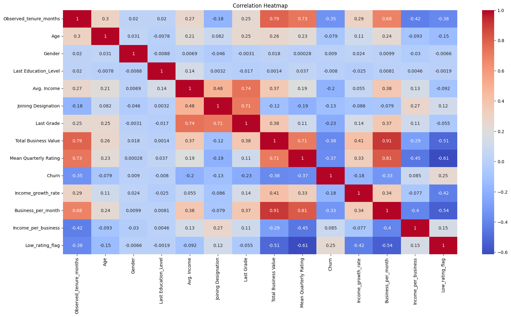

**Churn rate varies meaningfully by city**, reinforcing that geography carries signal beyond the individual driver's own metrics:

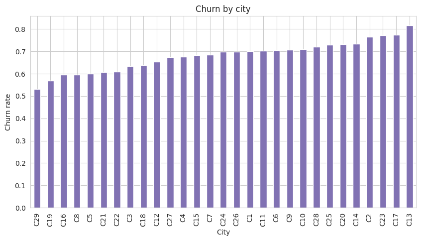

## Feature Engineering

- `Income_per_business` — income relative to business value generated (earning efficiency)
- `Business_per_month` — average monthly productivity
- `Income_growth_rate` — (Last Income − First Income) / First Income, capturing salary progression
- `Low_rating_flag` — binary flag for chronically low-rated drivers
- Highly correlated columns were dropped to reduce redundancy
- `Age_bin` was explored but ultimately dropped in favor of raw `Age`, since tree ensembles learn their own thresholds and don't need pre-binned features

## Modeling Approach

- **Split:** 80/20 stratified train/test (1,904 / 477 drivers)
- **Encoding:** label encoding for `City` — appropriate for tree models, which split on thresholds rather than assuming distance/ordering
- **Scaling:** intentionally skipped — tree splits are invariant to monotonic feature scaling
- **Imbalance handling:** `class_weight="balanced"` for Random Forest; `scale_pos_weight` (tuned via Optuna) for XGBoost/LightGBM
- **Hyperparameter search:** Optuna (Bayesian/TPE optimization), maximizing 5-fold cross-validated **PR-AUC** (`average_precision`) — chosen over grid search (too expensive) and random search (too undirected)
- **Threshold strategy:** in addition to the default 0.5 cutoff, a business-optimal threshold was selected per model, prioritizing **recall** — since a missed churner (false negative) costs the business more than an unnecessary retention incentive (false positive)

## Hyperparameter Tuning (Optuna)

Each model was tuned with Optuna over 5-fold CV, optimizing PR-AUC directly.

### Random Forest — 50 trials

| | CV PR-AUC | Test ROC-AUC | Test PR-AUC |
|---|---|---|---|
| Untuned baseline (`n_estimators=400`, default depth) | — | 0.846 | 0.893 |
| **Tuned** | **0.895** | **0.864** | **0.916** |

**Best params:** `n_estimators=800`, `max_depth=8`, `min_samples_split=30`, `min_samples_leaf=10`, `max_features=0.8`, `bootstrap=True`, `class_weight="balanced"`

| | Confusion matrix (default) | ROC / PR curves |
|---|---|---|
| **Before tuning** | 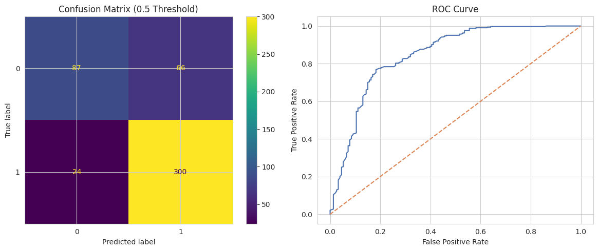 | 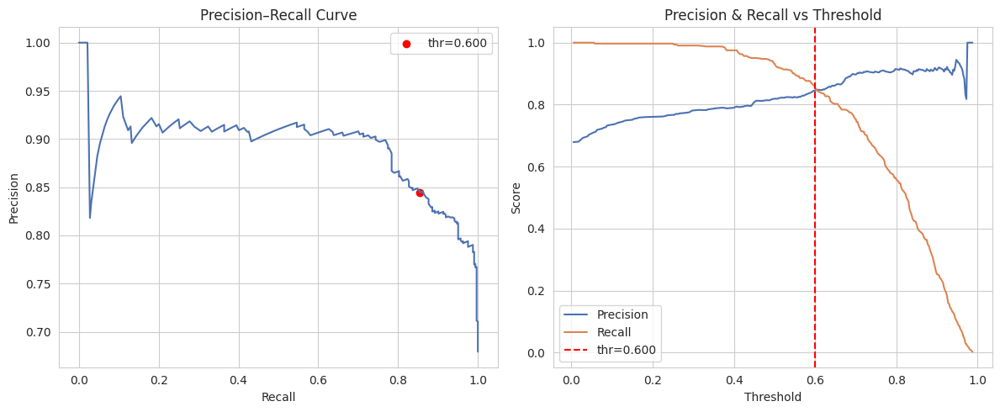 |
| **After tuning** | 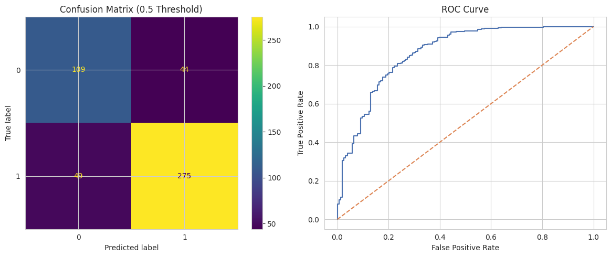 | 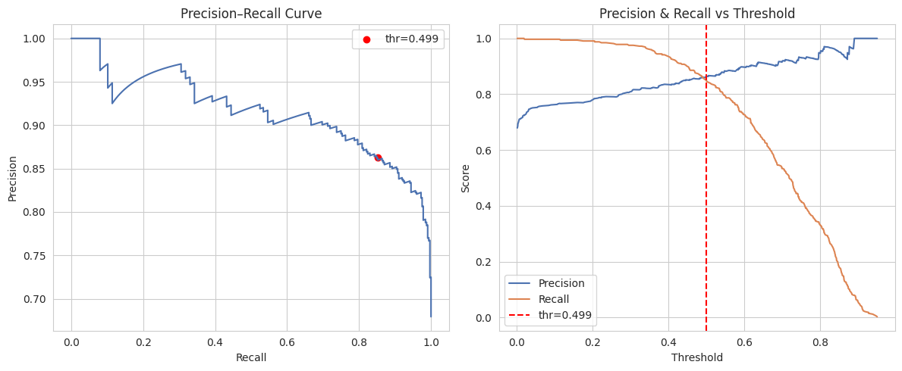 |

### XGBoost — 80 trials

**Best CV PR-AUC:** 0.907
**Best params:** `n_estimators=600`, `max_depth=4`, `learning_rate=0.01`, `subsample=1.0`, `colsample_bytree=0.8`, `gamma=0.3`, `min_child_weight=5`, `scale_pos_weight≈0.583` (tuned around the class-imbalance ratio rather than fixed)

| Confusion matrix | ROC / PR curves |
|---|---|
| 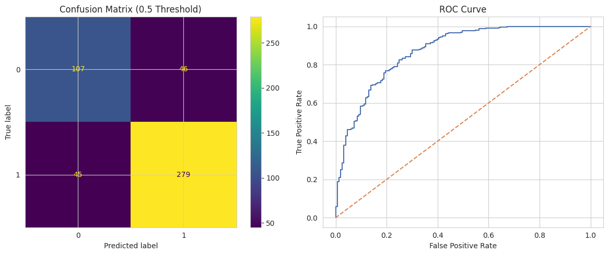 | 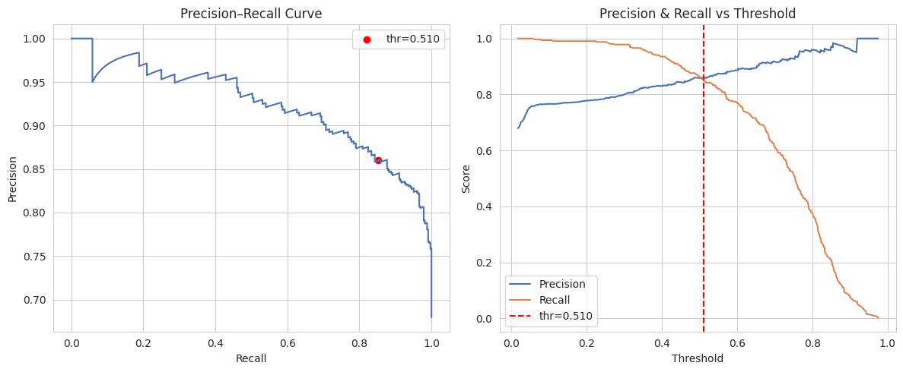 |

### LightGBM — 60 trials

**Best CV PR-AUC:** 0.908
**Best params:** `n_estimators=400`, `max_depth=4`, `learning_rate=0.01`, `num_leaves=40`, `subsample=1.0`, `colsample_bytree=0.9`, `min_child_samples=30`, `scale_pos_weight≈0.278`

| Confusion matrix | ROC / PR curves |
|---|---|
| 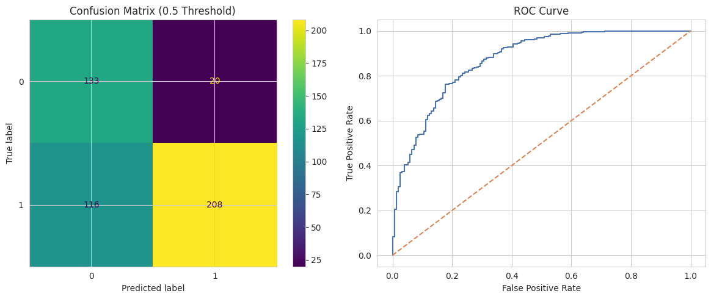 | 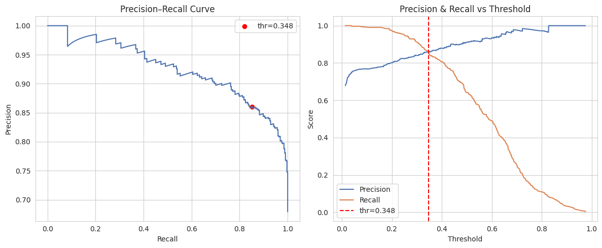 |

All three searches converged on **shallow trees with a low learning rate** (where applicable) and moderate regularization — consistent with a dataset of ~1,900 training rows, where deep/high-capacity trees would overfit.

## Results Summary

| Model | Precision | Recall | F1 | ROC-AUC | PR-AUC |
|---|---|---|---|---|---|
| Random Forest (tuned) | 0.862 | 0.849 | 0.855 | 0.864 | 0.916 |
| XGBoost (tuned) | 0.858 | 0.861 | 0.860 | 0.871 | 0.923 |
| LightGBM (tuned) | 0.912 | 0.642 | 0.754 | 0.872 | 0.925 |

*Metrics on the held-out test set (477 drivers) at each model's default 0.5 threshold, post-tuning.*

- All three models land in a similar performance band; **XGBoost** gives the best precision/recall balance, **LightGBM** trades recall for very high precision, and all three can be pushed toward higher recall via threshold tuning
- At threshold ≈0.3, tuned XGBoost recall exceeds **0.97** while precision holds around **0.80** — this is closer to the operating point OLA would actually want, given the recall-first business objective

## Feature Importance

Feature importance rankings were highly consistent across all three algorithms:

| Random Forest | XGBoost | LightGBM |
|---|---|---|
| 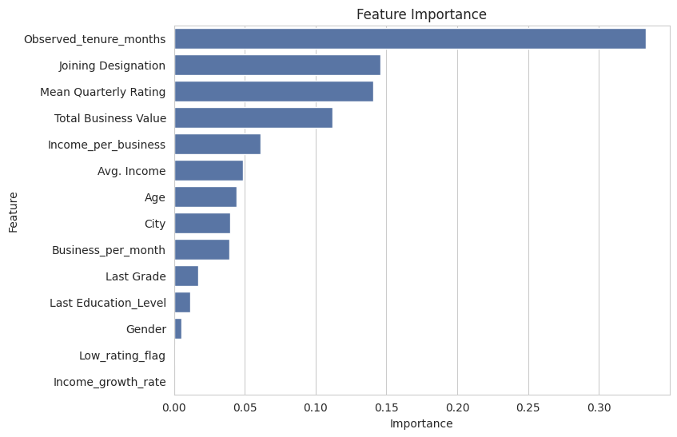 | 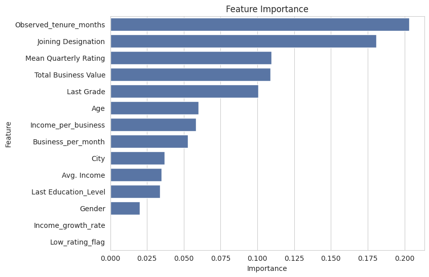 | 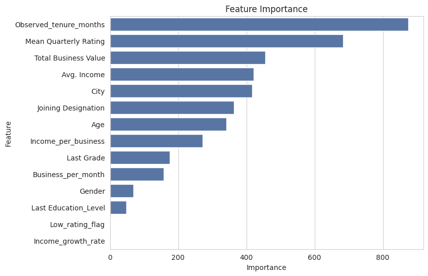 |

**Top drivers of churn prediction (consistent across all three models):**
1. `Observed_tenure_months`
2. `Joining Designation`
3. `Mean Quarterly Rating`
4. `Total Business Value`
5. `Last Grade` / `Avg. Income`
6. `Income_per_business`

`Income_growth_rate` and `Low_rating_flag` contributed almost nothing once the underlying rating and tenure signals were included — likely redundant with other features.

## Business Questionnaire (Selected Answers)

- **Optimization metric:** Recall is prioritized over precision/F1/ROC-AUC — missing an at-risk driver is more costly than flagging a driver who wasn't going to leave, since driver-supply gaps ripple into wait times, cancellations, and surge pricing
- **Rating vs. Age correlation:** ~0.17 — negligible
- **City with most improved rating (2019→2020):** C29 (+0.195)
- **Rating drop impact:** a significant quarterly-rating drop is followed by a **~47% decline** in next-period business value
- **Seasonality:** average ratings run 1.9–2.1 year-round, with a mild Jan–Mar rise followed by an April dip (effect size ~0.2 rating points)

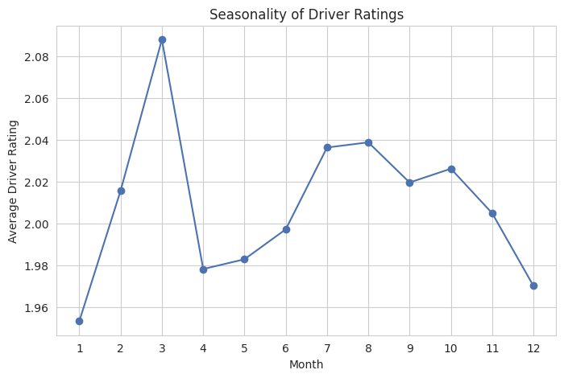
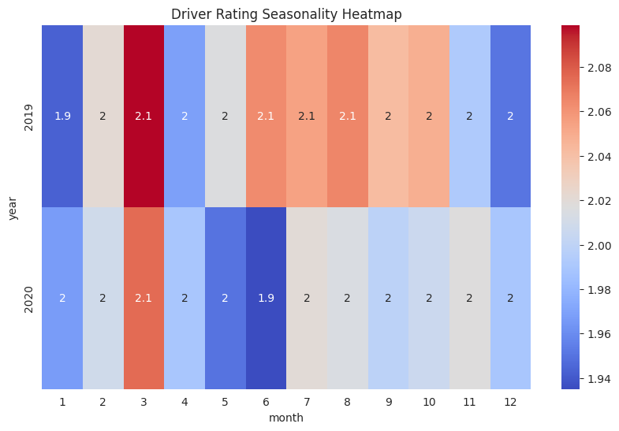

## Recommendations

- Build an **early-warning system** using the churn model to flag high-risk drivers for proactive outreach, temporary bonuses, or priority ride allocation
- **Targeted training** for low-rated drivers, especially around cancellation handling
- **Reward high-performing drivers** (weekly bonuses, fuel incentives, surge priority) to reinforce retention of the drivers most worth keeping
- Address **customer-side churn triggers** — unfair ratings, false complaints, late cancellations — through rating moderation and complaint verification
- Establish a **feedback loop**: monthly monitoring of precision/recall/PR-AUC, quarterly retraining, and exit surveys to keep the model aligned with actual churn drivers

## Tech Stack

`pandas` · `numpy` · `scikit-learn` · `XGBoost` · `LightGBM` · `Optuna` · `matplotlib` · `seaborn`

## Repository Contents

- `OLA_Drivers__Churn_Analysis_Ensemble_Learning.ipynb` — full analysis notebook (EDA → feature engineering → model tuning → evaluation → business recommendations)
- `images/` — exported plots referenced in this README
